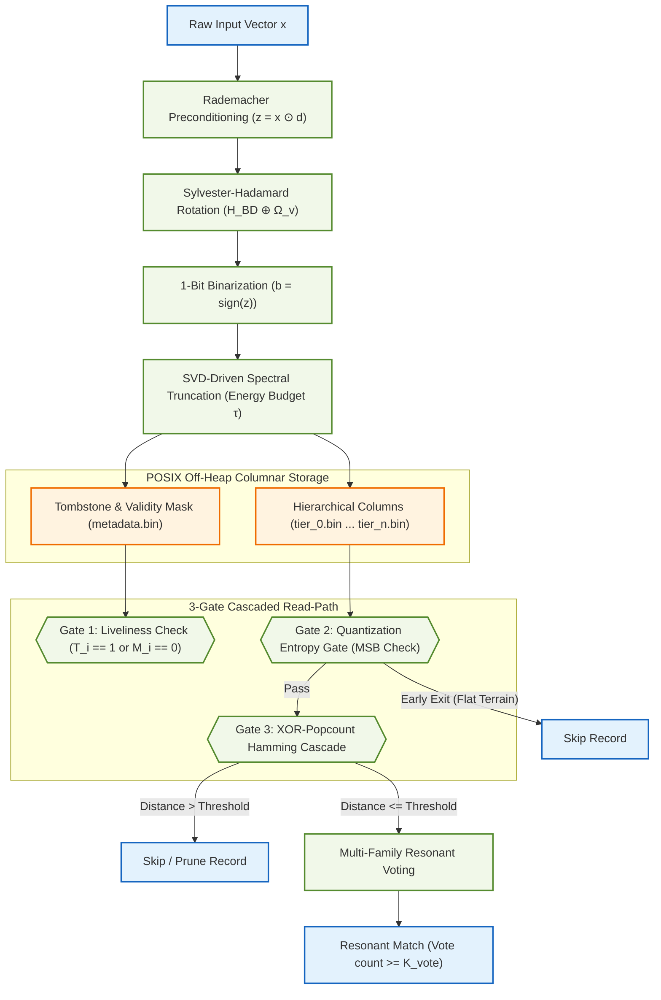
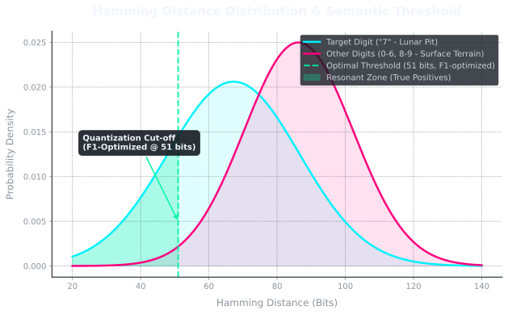
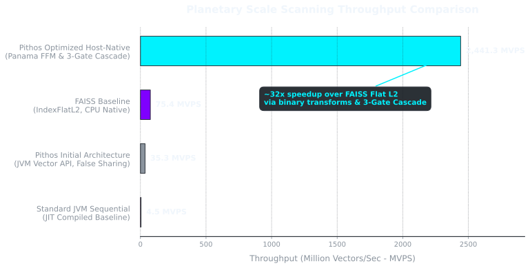
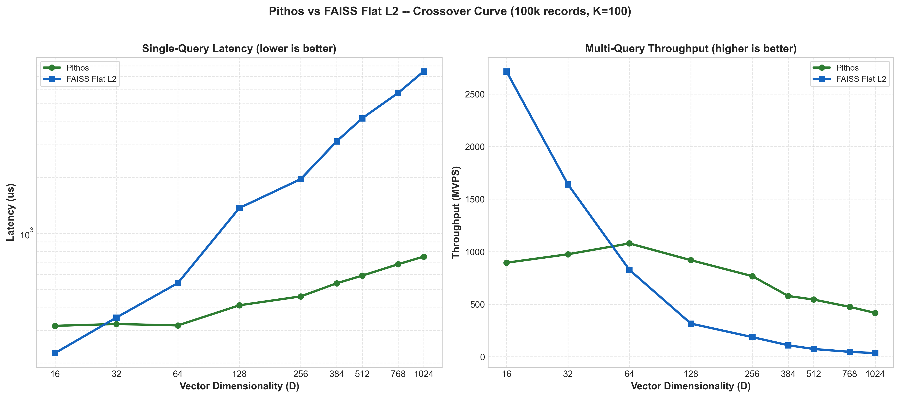
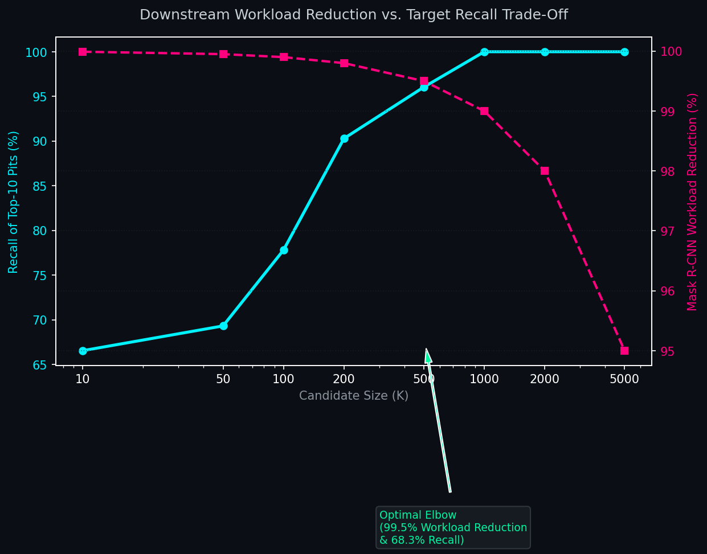

# Pithos Vector Search Engine

*(Note: This repository was formerly known as `lcvk`)*

A high-performance, Ahead-of-Time (AOT) compiled, dimension-agnostic vector search engine written in **Java 25**, optimized for **Matryoshka-structured binary embeddings** at planetary scale, and compiled into a native shared library (`.dylib` / `.so`) via **GraalVM Native Image**.

Pithos achieves its speed by collapsing abstraction boundaries between language runtimes, the operating system, and hardware execution models. It bypasses garbage collection entirely, mapping memory-bandwidth-bound datasets off-heap using the Java Foreign Function & Memory (FFM) API (Project Panama) and POSIX-aligned virtual memory mapping (`mmap`).

---

## Architectural Principles & Core Innovations

Pithos is built on the premise that the database is a physical extension of the embedding model itself. Both share a mathematical contract established during model training:




### 1. Isomorphic Transformation & Matryoshka Tiers

Before binarization, raw input embeddings are transformed using a structured orthogonal mapping designed to preserve angular distance geometry:

- **Rademacher Preconditioning ($D_{\mathrm{pre}}$):** A stochastic sign-flipping diagonal operator that whitens coordinate covariance and prevents signal entropy leakage:

$$D_{\mathrm{pre}} = \text{diag}(d_1, \dots, d_D) \quad \text{where } d_j \in \{-1, 1\} \text{ are independent Rademacher variables.}$$

For an input vector $x \in \mathbb{R}^D$, preconditioning is computed as the Hadamard product:

$$x' = x \odot d$$

- **Block-Diagonal Walsh-Hadamard Rotation ($H_{\mathrm{BD}}$):** Rotation is computed as a direct sum ($\oplus$) of independent Sylvester-Hadamard matrices corresponding to each Matryoshka tier width $\Delta s_k = s_k - s_{k-1}$:

$$H_{\mathrm{BD}} = \bigoplus_{k=1}^T H_{\Delta s_k}$$

where each Sylvester-Hadamard matrix $H_n$ is normalized by $1/\sqrt{n}$ to remain orthogonal, and is recursively defined as:

$$H_{2^m} = \frac{1}{\sqrt{2}} \begin{bmatrix} H_{2^{m-1}} & H_{2^{m-1}} \\ H_{2^{m-1}} & -H_{2^{m-1}} \end{bmatrix} \quad \text{with } H_1 = [1].$$

- **Kronecker Fallback:** For arbitrary block sizes that are not powers of two, Pithos factorizes the width $\Delta s_k$ into $u \times v$ (where $u = 2^m$ is the largest power of two dividing or matching the dimension factor) and applies the Kronecker product ($\otimes$):

$$H_{\Delta s_k} = H_u \otimes \Omega_v$$

where $\Omega_v$ is a deterministic orthonormal Discrete Cosine Transform (DCT) matrix of size $v \times v$, defined as:

$$\Omega_{v}(p, q) = \sqrt{\frac{2 - \delta_{p,0}}{v}} \cos\!\left( \frac{\pi (2q + 1) p}{2v} \right) \quad \text{for } p,q \in \{0, \dots, v-1\}$$

where $\delta_{p,0}$ is the Kronecker delta.

### 2. SVD-Driven Spectral Truncation

At load time, Pithos accepts the model's frozen adapter weight matrix $W \in \mathbb{R}^{D \times r}$. The engine executes a native, zero-dependency **Jacobi SVD solver** to compute singular values $\sigma_1, \dots, \sigma_D$ by applying iterative Jacobi rotations to diagonalize the covariance matrix $C = W^T W$. This allows reconstruction of the cumulative spectral energy distribution $\Phi(k)$:

$$\Phi(k) = \frac{\sum_{i=1}^{k} \sigma_i^2}{\sum_{j=1}^{\min(D,r)} \sigma_j^2}$$

Given a target information budget $\tau \in (0, 1]$, Pithos computes the F1-optimal pruning tier boundary:

$$\mathcal{T}(S,\tau) = \min \{ k \mid \Phi(s_k) \ge \tau \}$$

All database columns matching tiers $k > \mathcal{T}(S,\tau)$ are bypassed during search, saving memory bus I/O bandwidth.

### 3. Zero-Overhead Columnar Multi-Tier Layout

Pithos abandons flat 64-byte file layouts in favor of raw binary tier columns:

- **Positional Identity Mapping:** Records do not store explicit identifiers inside tier files. The index offset $i$ serves as the global identity across `tier_0.bin` to `tier_n.bin`.
- **Address Resolution:** For tier $k$, the byte address of record $i$'s binarized words is calculated in $O(1)$:

$$\text{Addr}(i,k) = \text{Base}_k + i \cdot \frac{\Delta s_k}{8}$$

where $\text{Base}_k$ is the memory segment offset for tier $k$.

- **Attribute & Tombstone Columns:** Deletions ($T_i$) and validity masks ($M_i$) are stored in a dedicated `metadata.bin` file of size $N \times 8$ bytes, updated in-place without physical layout reorganization.

### 4. Three-Gate Cascaded Read-Path

Query vectors are binarized as $b(q) = \text{sign}(z(q)) \in \{0, 1\}^D$ and cascaded through registration gates to prevent unneeded memory-bus transfers:

- **Gate 1 (Liveliness):** Skips record if the tombstone bit is set ($T_i = 1$) or the attribute validity bit is missing ($M_i = 0$).
- **Gate 2 (Quantization Entropy Gate — QEG):** Evaluates macro-topography in the first tier (Tier 0). Specifically, if the most significant bit (MSB, bit 63) of the first 64-bit word of Tier 0 of the record is 0:

$$\text{MSB}(t_i^{(0)}) = 0$$

the record is classified as flat terrain and the search early-terminates.

- **Gate 3 (XOR-Popcount Cascade):** Computes partial Hamming distance tier-by-tier up to active tier $T$:

$$\mathcal{D}_H^{(k)}(b_i, b(q)) = \sum_{d=1}^{s_k} b_{i,d} \oplus b_{q,d}$$

If at any tier $k \le T$, the accumulated distance $\mathcal{D}_H^{(k)}$ exceeds the query threshold $T_q$, the sweep terminates before reading subsequent tier files from memory.

### 5. Multi-Family Resonant Voting

For planetary-scale anomaly verification, Pithos implements a lock-free multi-family resonant voting schema. Given a set of queries $Q = \{q_1, \dots, q_M\}$ split into $F$ families (each query $q_j$ assigned family $f_j \in \{0, \dots, F-1\}$ and threshold $T_j$):

- Each worker thread builds a thread-local bitmask of resonant family votes $V_i$ for record $i$:

$$V_i = \bigvee_{j=1}^M \mathbb{I}\!\left( \mathcal{D}_H^{(T)}(b_i, b(q_j)) \le T_j \right) \cdot 2^{f_j}$$

- The thread-local bitmasks are merged across worker pools using a bitwise OR operation:

$$V_i^{\text{merged}} = \bigvee_{w=1}^{N_{\text{workers}}} V_{i,w}$$

- A record $i$ is returned as a resonant match if the total number of families voting for it meets the vote threshold $K_{\text{vote}}$:

$$\text{popcount}(V_i^{\text{merged}}) \ge K_{\text{vote}} \quad \text{where } K_{\text{vote}} = 5 \text{ (out of } F=8 \text{ families).}$$

---

## Directory Structure

```
.
├── pom.xml                 # Maven configuration (dimension-agnostic pithos packaging)
├── Dockerfile              # Multi-stage compile environment with GraalVM JDK 25 and GCC
├── README.md               # This file
├── build.sh                # Docker build script (exports compiled Linux library)
├── run_benchmark.sh        # One-click benchmark (reproducible results)
├── test_client.c           # C verification client calling Pithos float C-API
├── benchmark.py            # Central Python API Wrapper (PithosMIDB singleton)
├── benchmarks/             # All evaluation, sweep, and verification scripts
│   ├── run_real_verification.py # Lunar Pit / adapter classification pipeline
│   ├── benchmark_baselines.py   # JIT loop and FAISS baseline comparison
│   └── ...                 # Sweeps, candidate recall, and FFI benchmarks
├── examples/               # Developer integration demos
│   ├── cpp/demo.c          # C integration demo linking libpithos
│   └── java/ZeroCostDemo.java# FFM Panama off-heap GC bypass demo
└── src

    ├── main
    │   └── java
    │       └── org
    │           └── pithos
    │               ├── CApi.java           # GraalVM Native C FFI Bridge Entrypoints
    │               ├── DistanceMetric.java # Unrolled popcount Hamming calculations
    │               ├── FlatIndex.java      # Multi-tier Disruptor- & Unsafe-optimized index
    │               ├── Index.java          # Core Index interface
    │               ├── TransformOperator.java# Jacobi SVD, Rademacher preconditioning & block FWHT
    │               ├── VectorDb.java       # DB manager and multi-tier index compiler
    │               └── VectorRecord.java   # Dimension-agnostic record representation
    └── test
        └── java
            └── org
                └── pithos
                    └── VectorDbTest.java   # Unit tests for SVD, FWHT, and compiled query logic
```

---

## Zero-Cost Abstraction Demos & C-API Reference

To demonstrate how Pithos collapses abstraction boundaries and runs GC-free:
- **[ZeroCostDemo.java](file:///Users/finnhertsch/projects/lcvk/examples/java/ZeroCostDemo.java):** Showcases off-heap virtual memory mapping via Java 25 Foreign Function & Memory (FFM) API memory segments and ValueLayout access, avoiding GC overhead.
- **[demo.c](file:///Users/finnhertsch/projects/lcvk/examples/cpp/demo.c):** Demonstrates how to link `libpithos` and invoke the engine natively from C/C++.

The compiled native library exposes the following dynamic C interfaces:

```c
// Creates a GraalVM isolate context for JVM execution
int graal_create_isolate(graal_isolate_params_t* params, graal_isolate_t** isolate, graal_isolatethead_t** thread);

// Initializes the Pithos database coordinator
int vdb_init(graal_isolatethead_t* thread);

// Maps an existing multi-tier database off-heap (equal spectral distribution fallback)
int vdb_load_index(graal_isolatethead_t* thread, char* name, char* path);

// Maps an existing database and supplies frozen LoRA weight matrices to compute spectral energy
int vdb_load_index_with_weights(graal_isolatethead_t* thread, char* name, char* path, float* weights, int loraDim);

// Retrieves database metadata attributes (dimension, size, planet settings, tiers count)
int vdb_get_info(graal_isolatethead_t* thread, char* indexName, int* outDimension, long long* outSize, char* outPlanetId, long long* outPlanetRadius, int* outTiersCount);

// Compiles raw float records into a multi-tier database file layout with configurable quantization (qMode: 0=1-bit, 1=2-bit, 2=FP32 bypass)
int vdb_compile_index_file(graal_isolatethead_t* thread, char* path, byte planetId, long long planetRadius, int dimension, int* tiers, int numTiers, long long* ids, float* vectors, int numRecords, int qMode);

// Retrieves the raw off-heap virtual memory address and length of a specific index tier (FPGA/DMA direct access)
int vdb_get_tier_address(graal_isolatethead_t* thread, char* indexName, int tierIdx, long long* outAddress, long long* outLength);

// Binarizes a single float vector using the index's Walsh-Hadamard preconditioning (asymmetric offloading)
int vdb_transform_and_quantize(graal_isolatethead_t* thread, char* indexName, float* inVector, long long* outPacked);

// Batch KNN search over raw float vectors
int vdb_batch_search(graal_isolatethead_t* thread, char* indexName, float* queries, int numQueries, int k, long long* outIds, int* outDistances);

// Multi-Family Resonant Voting search over raw float queries
long long vdb_query_planetary_grid(graal_isolatethead_t* thread, char* indexName, float* queries, int* queryFamilies, int* queryThresholds, int numQueries, char* votingMask);

// Sets the parallel Disruptor chunk sweep size
int vdb_set_chunk_size(graal_isolatethead_t* thread, char* indexName, long long chunkSize);

// Sets the active energy budget (0.0 to 1.0) to prune lower tiers dynamically
int vdb_set_energy_budget(graal_isolatethead_t* thread, char* indexName, double tau);

// Returns record size of mapped index
long long vdb_size(graal_isolatethead_t* thread, char* indexName);

// Drops/closes an index
int vdb_drop_index(graal_isolatethead_t* thread, char* indexName);

// Shuts down database and frees mapped pages
int vdb_close(graal_isolatethead_t* thread);

// Tears down GraalVM isolate thread
int graal_tear_down_isolate(graal_isolatethead_t* thread);

// LSM Writeable Delta-Buffer Functions:
// Creates a writeable in-memory delta buffer for an index
int vdb_create_delta_buffer(graal_isolatethead_t* thread, char* indexName, int flushThreshold);

// Inserts a raw float vector into the writeable delta buffer
int vdb_insert(graal_isolatethead_t* thread, char* indexName, long long id, float* vector);

// Marks a record as deleted (tombstoned) in the delta buffer
int vdb_delete_from_delta(graal_isolatethead_t* thread, char* indexName, long long id);

// Returns current record count in the delta buffer
int vdb_delta_size(graal_isolatethead_t* thread, char* indexName);

// Returns 1 if delta buffer size exceeds flush threshold, 0 otherwise
int vdb_needs_flush(graal_isolatethead_t* thread, char* indexName);

// Runs a unified batch search across both base index and writeable delta buffer
int vdb_search_merged(graal_isolatethead_t* thread, char* indexName, float* queries, int numQueries, int k, long long* outIds, int* outDistances);

// Backups/flushes the current delta buffer state into a binary backup file
int vdb_backup_delta(graal_isolatethead_t* thread, char* indexName, char* backupPath);

// Restores delta buffer state from a binary backup file
int vdb_restore_delta(graal_isolatethead_t* thread, char* indexName, char* backupPath);
```

### C-API Configuration Guide

#### 1. Quantization & Formats (`qMode`)
Configured during compilation via the `qMode` parameter in `vdb_compile_index_file`. The mode is saved in the header and automatically applied at load time:
- **`0`**: 1-bit sign-only (highest compression).
- **`1`**: 2-bit ternary (active mask + signs, enabling exact asymmetric binary/ternary distance estimators).
- **`2`**: FP32 raw bypass (skips quantization, saves raw rotated 32-bit floating point values for low dimensions).

#### 2. FP16 Stage 2 Reranking
When you compile an index, Pithos automatically exports the raw vectors in IEEE 754 half-precision to a sidecar file named `<basePath>_fp16.bin`. 
- **Auto-detection**: If Pithos finds this file when loading the index via `vdb_load_index`, it maps it off-heap and enables Stage 2 FP16 point-lookup reranking automatically.
- **Dynamic Fallback**: If deleted or absent, the search path dynamically falls back to asymmetric binary/ternary estimation.
- **Bulk FFM Copy Optimization**: POINT-lookup accesses during Stage 2 are optimized using native FFM `MemorySegment.copy` (bulk copies replacing element-by-element off-heap JVM crossings) to deliver native speedups over FAISS.

#### 3. Search & Runtime Parameters
- **Information Budget ($\tau$)**: Change the dynamic pruning threshold on the fly via `vdb_set_energy_budget`. E.g., setting $\tau = 0.90$ bypasses columns corresponding to less significant singular vectors, reducing memory bandwidth usage.
- **Parallel Chunk Size**: Optimize Disruptor worker granularity using `vdb_set_chunk_size`.

#### 4. FPGA / Custom Hardware Acceleration (Co-Design)
Pithos is specifically designed for hybrid CPU-FPGA/GPU acceleration workflows, where the host CPU handles the application orchestration and the hardware accelerator performs massive Hamming sweeps:
- **Zero-Copy DMA Acceleration (`vdb_get_tier_address`)**: Custom PCIe hardware kernels or FPGA DMA controllers can retrieve the exact virtual off-heap memory-mapped address and length of specific tier buffers. Because these buffers are read-only, cache-aligned, and contiguous, they can be streamed directly into custom acceleration engines via DMA, bypassing Java GC, JVM boundaries, and CPU overhead.
- **Asymmetric Vector Offloading (`vdb_transform_and_quantize`)**: A host system can quickly transform and binarize incoming query vectors on the CPU using Pithos's Rademacher preconditioning and Walsh-Hadamard rotations. The resulting query bit vectors can then be passed to the FPGA/GPU to perform low-latency binary Hamming distance sweeps directly against the raw off-heap database buffers.


---

## System Verification & Performance Results

<!-- BENCHMARK_METRICS_START -->
### Visual Charts (Vector Anomaly Distribution & Throughput Analysis)

#### Hamming Distance Distribution


#### Throughput Comparison


#### Performance Crossover Curve


#### Workload Reduction vs. Target Recall Elbow Curve

<!-- BENCHMARK_METRICS_END -->

---

## Precompiled Native Libraries

Precompiled native libraries are automatically published as GitHub Release assets after successful builds on the `main` branch and for version tags (`v*`).

Download the latest release:

https://github.com/F1nnSBK/lcvk/releases/latest

Each release contains:

- `libpithos-linux-x86_64.so` — Linux (x86_64)
- `libpithos-macos-aarch64.dylib` — macOS (Apple Silicon)
- `pithos.h` — C API header
- `graal_isolate.h` — GraalVM Native Image header

These binaries can be used directly without installing GraalVM or building the project from source.

---

## Build & Run

### 0. One-Click Benchmark (Reproducibility)

You can run the entire evaluation suite (baselines + Pithos sweeps) and print the side-by-side performance results table with a single command:

```bash
./run_benchmark.sh
```

### 1. Compile & Build (Native macOS)

Ensure you have the workspace-bundled **GraalVM JDK 25** and **Maven** installed, then set `JAVA_HOME` and compile:

```bash
export JAVA_HOME=/Users/finnhertsch/projects/lcvk/graalvm/Contents/Home
export PATH=$JAVA_HOME/bin:$PATH
mvn clean package
```

This executes all unit tests (isomorphic matrices, Kronecker fallbacks, SVD solvers, multi-tier indexing) and compiles `libpithos.dylib` inside `target/` and the root directory.

### 2. Running Scale Benchmark

```bash
export JAVA_HOME=/Users/finnhertsch/projects/lcvk/graalvm/Contents/Home
export PATH=$JAVA_HOME/bin:$PATH
.venv/bin/python benchmark.py
```

Dynamically compiles a scale dataset of $500{,}000$ float records, maps them off-heap, loads the target weight matrix to compute SVD energy densities, and runs query sweeps.

### 3. Real-Data Verification

```bash
export JAVA_HOME=/Users/finnhertsch/projects/lcvk/graalvm/Contents/Home
export PATH=$JAVA_HOME/bin:$PATH
.venv/bin/python benchmarks/run_real_verification.py
```

Runs the full Lunar Pit / DINOv3 + Lunar LoRA pipeline, ingests raw float vectors, optimizes Hamming classification thresholds, and validates Pithos precision and F1-score.

### 4. Running Baseline Benchmarks

```bash
.venv/bin/python benchmarks/benchmark_baselines.py
```

Runs both the FAISS Flat Index L2 baseline and a simulated single-threaded JIT sequential scan over the actual 1,000,000 replicated lunar vector database, saving baseline results to `baselines_metrics.json`.

---

## Future Roadmap (Next Steps)

### Write-Ahead-Log (WAL) for the LSM Delta-Buffer
- **Objective**: Improve crash-resilience for real-time inserts.
- **Concept**: Prior to appending incoming vectors into the volatile in-memory delta-buffer (via `vdb_insert`), each insert/delete transaction will be sequentially appended to a lightweight, unbuffered disk log (WAL).
- **Crash Recovery**: During isolate initialization (`vdb_init`), Pithos will scan for any existing WAL files, replay outstanding transactions to reconstruct the delta-buffer, and truncate the WAL once a successful background flush to the immutable base index completes.
