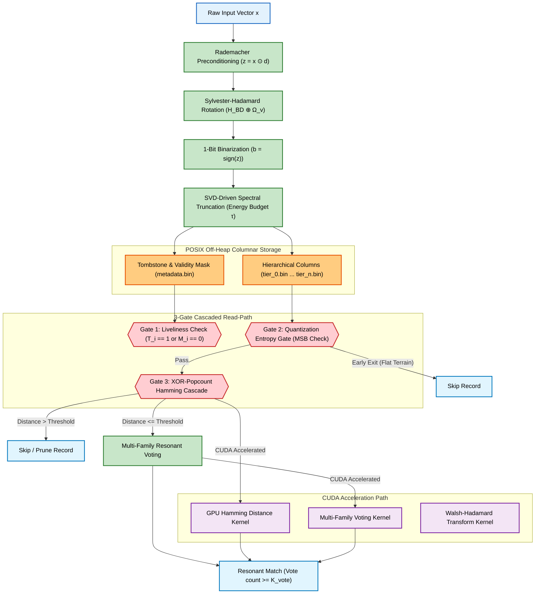

# Pithos Architectural Principles & Core Innovations

This document details the mathematical, algorithmic, and hardware-co-design principles underlying the Pithos Vector Search Engine.

---

## System Overview

Pithos is built on the premise that the database is a physical extension of the embedding model itself. Both share a mathematical contract established during model training:

---

## 1. Isomorphic Transformation & Matryoshka Tiers

Before binarization, raw input embeddings are transformed using a structured orthogonal mapping designed to preserve angular distance geometry:

- **Rademacher Preconditioning ($D_{\mathrm{pre}}$):** A stochastic sign-flipping diagonal operator that whitens coordinate covariance and prevents signal entropy leakage:

$$D_{\mathrm{pre}} = \text{diag}(d_1, \dots, d_D) \quad \text{where } d_j \in \{-1, 1\} \text{ are independent Rademacher variables.}$$

For an input vector $x \in \mathbb{R}^D$, preconditioning is computed as the Hadamard product:

$$x' = x \odot d$$

- **Block-Diagonal Walsh-Hadamard Rotation ($H_{\mathrm{BD}}$):** Rotation is computed as a direct sum ($\oplus$) of independent Sylvester-Hadamard matrices corresponding to each Matryoshka tier width $\Delta s_k = s_k - s_{k-1}$:

$$H_{\mathrm{BD}} = \bigoplus_{k=1}^T H_{\Delta s_k}$$

where each Sylvester-Hadamard matrix $H_n$ is normalized by $1/\sqrt{n}$ to remain orthogonal, and is recursively defined as:

$$H_{2^m} = \frac{1}{\sqrt{2}} \begin{bmatrix} H_{2^{m-1}} & H_{2^{m-1}} \\ H_{2^{m-1}} & -H_{2^{m-1}} \end{bmatrix} \quad \text{with } H_1 = [1].$$

- **Kronecker Fallback:** For arbitrary block sizes that are not powers of two, Pithos factorizes the width $\Delta s_k$ into $u \times v$ (where $u = 2^m$ is the largest power of two dividing or matching the dimension factor) and applies the Kronecker product ($\otimes$):

$$H_{\Delta s_k} = H_u \otimes \Omega_v$$

where $\Omega_v$ is a deterministic orthonormal Discrete Cosine Transform (DCT) matrix of size $v \times v$, defined as:

$$\Omega_{v}(p, q) = \sqrt{\frac{2 - \delta_{p,0}}{v}} \cos\!\left( \frac{\pi (2q + 1) p}{2v} \right) \quad \text{for } p,q \in \{0, \dots, v-1\}$$

where $\delta_{p,0}$ is the Kronecker delta.

---

## 2. SVD-Driven Spectral Truncation

At load time, Pithos accepts the model's frozen adapter weight matrix $W \in \mathbb{R}^{D \times r}$. The engine executes a native, zero-dependency **Jacobi SVD solver** to compute singular values $\sigma_1, \dots, \sigma_D$ by applying iterative Jacobi rotations to diagonalize the covariance matrix $C = W^T W$. This allows reconstruction of the cumulative spectral energy distribution $\Phi(k)$:

$$\Phi(k) = \frac{\sum_{i=1}^{k} \sigma_i^2}{\sum_{j=1}^{\min(D,r)} \sigma_j^2}$$

Given a target information budget $\tau \in (0, 1]$, Pithos computes the F1-optimal pruning tier boundary:

$$\mathcal{T}(S,\tau) = \min \{ k \mid \Phi(s_k) \ge \tau \}$$

All database columns matching tiers $k > \mathcal{T}(S,\tau)$ are bypassed during search, saving memory bus I/O bandwidth.

---

## 3. Zero-Overhead Columnar Multi-Tier Layout

Pithos abandons flat 64-byte file layouts in favor of raw binary tier columns:

- **Positional Identity Mapping:** Records do not store explicit identifiers inside tier files. The index offset $i$ serves as the global identity across `tier_0.bin` to `tier_n.bin`.
- **Address Resolution:** For tier $k$, the byte address of record $i$'s binarized words is calculated in $O(1)$:

$$\text{Addr}(i,k) = \text{Base}_k + i \cdot \frac{\Delta s_k}{8}$$

where $\text{Base}_k$ is the memory segment offset for tier $k$.

- **Attribute & Tombstone Columns:** Deletions ($T_i$) and validity masks ($M_i$) are stored in a dedicated `metadata.bin` file of size $N \times 8$ bytes, updated in-place without physical layout reorganization.

---

## 4. Three-Gate Cascaded Read-Path

Query vectors are binarized as $b(q) = \text{sign}(z(q)) \in \{0, 1\}^D$ and cascaded through registration gates to prevent unneeded memory-bus transfers:

- **Gate 1 (Liveliness):** Skips record if the tombstone bit is set ($T_i = 1$) or the attribute validity bit is missing ($M_i = 0$).
- **Gate 2 (Quantization Entropy Gate — QEG):** Evaluates macro-topography in the first tier (Tier 0). Specifically, if the most significant bit (MSB, bit 63) of the first 64-bit word of Tier 0 of the record is 0:

$$\text{MSB}(t_i^{(0)}) = 0$$

the record is classified as flat terrain and the search early-terminates.

- **Gate 3 (XOR-Popcount Cascade):** Computes partial Hamming distance tier-by-tier up to active tier $T$:

$$\mathcal{D}_H^{(k)}(b_i, b(q)) = \sum_{d=1}^{s_k} b_{i,d} \oplus b_{q,d}$$

If at any tier $k \le T$, the accumulated distance $\mathcal{D}_H^{(k)}$ exceeds the query threshold $T_q$, the sweep terminates before reading subsequent tier files from memory.

---

## 5. Multi-Family Resonant Voting

For planetary-scale anomaly verification, Pithos implements a lock-free multi-family resonant voting schema. Given a set of queries $Q = \{q_1, \dots, q_M\}$ split into $F$ families (each query $q_j$ assigned family $f_j \in \{0, \dots, F-1\}$ and threshold $T_j$):

- Each worker thread builds a thread-local bitmask of resonant family votes $V_i$ for record $i$:

$$V_i = \bigvee_{j=1}^M \mathbb{I}\!\left( \mathcal{D}_H^{(T)}(b_i, b(q_j)) \le T_j \right) \cdot 2^{f_j}$$

- The thread-local bitmasks are merged across worker pools using a bitwise OR operation:

$$V_i^{\text{merged}} = \bigvee_{w=1}^{N_{\text{workers}}} V_{i,w}$$

- A record $i$ is returned as a resonant match if the total number of families voting for it meets the vote threshold $K_{\text{vote}}$:

$$\text{popcount}(V_i^{\text{merged}}) \ge K_{\text{vote}} \quad \text{where } K_{\text{vote}} = 5 \text{ (out of } F=8 \text{ families).}$$
