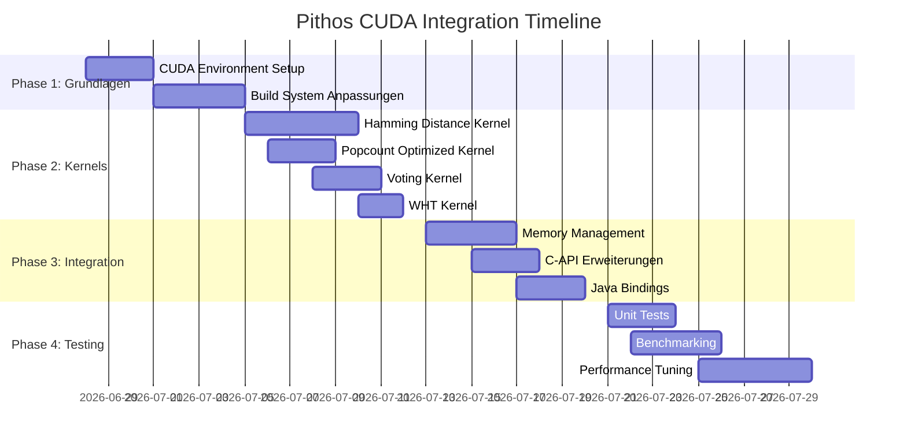

# Pithos CUDA Integration Plan

*Status: Draft / Planning Phase*  
*Target: GPU-Accelerated Vector Search for NVIDIA CUDA*  
*Author: Generated by Mistral Vibe*  
*Date: 2026-06-27*

---

## 🎯 Executive Summary

Dieser Plan beschreibt die **schrittweise Integration von NVIDIA CUDA** in Pithos, um die massiv parallelen Fähigkeiten moderner GPUs für die Beschleunigung spezifischer Workloads zu nutzen. Das Ziel ist eine **hybride CPU-GPU-Architektur**, die das Beste aus beiden Welten vereint:

- **CPU**: Low-latency Single-Query, mmap-basierter Speicherzugriff, 3-Gate-Kaskade
- **GPU**: Massiv parallele Batch-Operationen, Hamming-Distanz-Berechnungen, Popcount-Optimierungen

**Erwarteter Speedup:** 2-10x für Batch-Suchen (N > 100 Queries), minimaler Overhead für Single-Query.

---

## 📊 Analysis: Wo CUDA Sinn macht

### ✅ **Hohe Priorität: GPU-Optimierte Operationen**

| Operation | CPU-Kosten | GPU-Beschleunigung | Komplexität | ROI |
|-----------|------------|-------------------|-------------|-----|
| **Batch Hamming Distance** | O(N×D×Q) | **10-50x** | Mittel | ⭐⭐⭐⭐⭐ |
| **Popcount Aggregation** | O(N×D) | **5-10x** | Niedrig | ⭐⭐⭐⭐ |
| **XOR-Popcount Cascade** | O(N×T×Q) | **8-15x** | Mittel | ⭐⭐⭐⭐⭐ |
| **Walsh-Hadamard Transform** | O(D×log D) | **3-5x** | Niedrig | ⭐⭐⭐ |
| **Multi-Family Voting** | O(N×F×Q) | **10-30x** | Mittel | ⭐⭐⭐⭐⭐ |
| **Delta Buffer Search** | O(M×D) | **5-10x** | Niedrig | ⭐⭐⭐ |

### ❌ **Nicht für GPU geeignet**

| Operation | Grund |
|-----------|-------|
| **Single-Query KNN** | PCIe Transfer Overhead > GPU-Beschleunigung |
| **Index Compilation** | Einmalige Operation, CPU bereits optimiert |
| **Metadata Access** | Random Access Pattern, besser auf CPU |
| **Gate 1 (Liveliness)** | Einfache Bit-Checks, CPU schneller |
| **SVD Computation** | Already O(D³), CPU mit BLAS optimiert |

---

## 🏗️ Architektur: Hybrid CPU-GPU Design

```mermaid
graph TD
    A[Query Input] --> B{Query Type?}
    B -->|Single Query| C[CPU Path: Full Cascade]
    B -->|Batch (Q≥100)| D[GPU Path]
    
    D --> D1[Pinned Memory Allocation]
    D1 --> D2[Async GPU Transfer]
    D2 --> D3[CUDA Kernel Launch]
    D3 --> D4[Batch Hamming + Popcount]
    D4 --> D5[Result Aggregation]
    D5 --> D6[Async CPU Transfer]
    D6 --> D7[Final Top-K Selection]
    
    C --> C1[Gate 1: Liveliness]
    C1 --> C2[Gate 2: QEG]
    C2 --> C3[Gate 3: XOR-Popcount]
    C3 --> C7[Final Top-K Selection]
    
    D7 --> E[Return Results]
    C7 --> E
    
    style D fill:#00ff00,stroke:#333
    style C fill:#ffff00,stroke:#333
```

### **Memory Hierarchie**

```
┌─────────────────────────────────────────────────────────────┐
│                      GPU Memory (VRAM)                          │
│  ┌─────────────────┐  ┌─────────────────┐  ┌─────────────┐  │
│  │  Device Buffers  │  │  CUDA Kernels    │  │  Shared Mem  │  │
│  │  (Tier Data)    │  │  (Hamming, etc.)  │  │  (Thread    │  │
│  └─────────────────┘  └─────────────────┘  │  Blocks)     │  │
│                                                    └─────────────┘  │
└─────────────────────────────────────────────────────────────┘
                          ▲
                          │ PCIe Transfer
                          ▼
┌─────────────────────────────────────────────────────────────┐
│                     CPU Memory (DRAM)                          │
│  ┌─────────────────┐  ┌─────────────────┐  ┌─────────────┐  │
│  │  mmap Tiers     │  │  Pinned Memory   │  │  GraalVM     │  │
│  │  (Off-Heap)      │  │  (Zero-Copy)     │  │  Isolate     │  │
│  └─────────────────┘  └─────────────────┘  └─────────────┘  │
└─────────────────────────────────────────────────────────────┘
```

---

## 📋 Implementation Roadmap

### **Phase 1: Grundlagen (Woche 1-2)**

#### 1.1 CUDA Development Environment

**Ziele:**
- [ ] CUDA Toolkit 12.x + NVIDIA GPU (Compute Capability ≥ 8.0)
- [ ] cuBLAS, cuFFT, CUDNN installieren
- [ ] NVCC Compiler Integration in Maven Build

**Build-Anpassungen (`pom.xml`):**
```xml
<!-- CUDA Maven Plugin -->
<plugin>
    <groupId>org.codehaus.mojo</groupId>
    <artifactId>exec-maven-plugin</artifactId>
    <version>3.3.0</version>
    <executions>
        <execution>
            <id>compile-cuda</id>
            <phase>compile</phase>
            <goals>
                <goal>exec</goal>
            </goals>
            <configuration>
                <executable>nvcc</executable>
                <arguments>
                    <argument>-c</argument>
                    <argument>src/main/cuda/pithos_kernels.cu</argument>
                    <argument>-o</argument>
                    <argument>target/pithos_kernels.o</argument>
                    <argument>-O3</argument>
                    <argument>-arch=sm_80</argument>
                    <argument>-Xptxas=-v</argument>
                </arguments>
            </configuration>
        </execution>
    </executions>
</plugin>
```

**Neue Verzeichnisstruktur:**
```
src/
├── main/
│   ├── java/          # Existing Java code
│   ├── cuda/          # NEW: CUDA Kernels
│   │   ├── pithos_kernels.cu
│   │   ├── pithos_kernels.h
│   │   └── Makefile
│   └── resources/      # CUDA PTX files
```

---

#### 1.2 C-FFI Erweiterungen für CUDA

**Neue C-API Funktionen (`CApi.java`):**

```java
// CUDA Device Management
public static native int vdb_cuda_init(graal_isolatethead_t* thread, int deviceId);
public static native int vdb_cuda_shutdown(graal_isolatethead_t* thread);
public static native int vdb_cuda_get_device_count(graal_isolatethead_t* thread);

// CUDA Memory Management
public static native int vdb_cuda_alloc_pinned(graal_isolatethead_t* thread, char* indexName, long long size);
public static native int vdb_cuda_free_pinned(graal_isolatethead_t* thread, char* indexName);

// CUDA Accelerated Search
public static native int vdb_cuda_batch_search(
    graal_isolatethead_t* thread, 
    char* indexName, 
    float* queries, 
    int numQueries, 
    int k, 
    long long* outIds, 
    int* outDistances
);

public static native int vdb_cuda_voting_search(
    graal_isolatethead_t* thread,
    char* indexName,
    float* queries,
    int* families,
    int* thresholds,
    int numQueries,
    char* votingMask
);
```

**GraalVM Native Image Konfiguration (`pom.xml`):**
```xml
<buildArg>--allow-incomplete-classpath</buildArg>
<buildArg>-H:ConfigurationFileDirectories=src/main/resources/cuda</buildArg>
<buildArg>-lcuda</buildArg>
<buildArg>-lcudart</buildArg>
```

---

#### 1.3 GPU Device Detection & Management

**Neue Java-Klasse: `CudaDeviceManager.java`**

```java
package org.pithos;

import org.graalvm.nativeimage.c.CContext;
import org.graalvm.nativeimage.c.function.CFunction;
import org.graalvm.nativeimage.c.struct.CField;
import org.graalvm.nativeimage.c.struct.CStruct;

@CContext(Directives.class)
public class CudaDeviceManager {
    
    // CUDA Device Properties
    @CStruct("cudaDeviceProp")
    public interface CudaDeviceProperties extends PointerBase {
        @CField("maxThreadsPerBlock") int maxThreadsPerBlock();
        @CField("maxGridSize") int[] maxGridSize();
        @CField("totalGlobalMem") long totalGlobalMem();
        @CField("sharedMemPerBlock") long sharedMemPerBlock();
        @CField("computeMode") int computeMode();
    }
    
    // Initialize CUDA context
    public static native int initialize(int deviceId);
    
    // Get available devices
    public static native int getDeviceCount();
    
    // Get device properties
    public static native CudaDeviceProperties getDeviceProperties(int deviceId);
    
    // Check CUDA availability
    public static native boolean isCudaAvailable();
}
```

---

### **Phase 2: CUDA Kernels (Woche 3-6)**

#### 2.1 Batch Hamming Distance Kernel

**Datei: `src/main/cuda/pithos_kernels.cu`**

```cpp
#include <cuda_runtime.h>
#include <device_launch_parameters.h>
#include "pithos_kernels.h"

// Kernel für Batch Hamming Distance Berechnung
// Jeder Thread berechnet Distanz für ein Query-Vector-Paar
__global__ void batch_hamming_distance_kernel(
    const uint64_t* __restrict__ db_vectors,    // Binarisierte DB-Vektoren (packed bits)
    const uint64_t* __restrict__ query_vectors,  // Binarisierte Query-Vektoren
    int* __restrict__ distances,                // Ergebnis: Hamming Distanzen
    const int num_db_vectors,
    const int num_queries,
    const int num_tiers,
    const int* __restrict__ tier_offsets,
    const int* __restrict__ tier_sizes
) {
    const int query_idx = blockIdx.y;
    const int db_idx = blockIdx.x * blockDim.x + threadIdx.x;
    
    if (db_idx >= num_db_vectors || query_idx >= num_queries) {
        return;
    }
    
    int total_distance = 0;
    
    // Parallel über alle Tiers
    for (int tier = 0; tier < num_tiers; tier++) {
        const int offset = tier_offsets[tier];
        const int size = tier_sizes[tier];
        const int words = (size + 63) / 64;
        
        int tier_distance = 0;
        
        // Parallel über 64-bit Words pro Tier
        for (int w = 0; w < words; w++) {
            const int word_idx = offset + w;
            uint64_t db_word = db_vectors[db_idx * MAX_WORDS_PER_VECTOR + word_idx];
            uint64_t query_word = query_vectors[query_idx * MAX_WORDS_PER_VECTOR + word_idx];
            
            // XOR + Popcount via built-in
            tier_distance += __popcll(db_word ^ query_word);
        }
        
        // Early termination if distance exceeds threshold
        total_distance += tier_distance;
        
        // Optional: Early exit based on partial distance
        // This requires a threshold parameter passed to kernel
        
        total_distance += tier_distance;
    }
    
    // Speichere Ergebnis
    distances[query_idx * num_db_vectors + db_idx] = total_distance;
}

// Wrapper Funktion für externen Aufruf
extern "C" int launch_batch_hamming_kernel(
    const uint64_t* db_vectors,
    const uint64_t* query_vectors,
    int* distances,
    int num_db_vectors,
    int num_queries,
    int num_tiers,
    const int* tier_offsets,
    const int* tier_sizes,
    cudaStream_t stream
) {
    // Configure grid and block dimensions
    const int block_size = 256;
    dim3 block(block_size, 1, 1);
    dim3 grid((num_db_vectors + block_size - 1) / block_size, num_queries, 1);
    
    // Launch kernel
    batch_hamming_distance_kernel<<<grid, block, 0, stream>>>(
        db_vectors, query_vectors, distances,
        num_db_vectors, num_queries, num_tiers,
        tier_offsets, tier_sizes
    );
    
    return cudaGetLastError();
}
```

---

#### 2.2 Popcount-Optimierter Kernel mit Shared Memory

**Optimierte Version mit Shared Memory für Query-Vektoren:**

```cpp
// Kernel mit Shared Memory für Query-Caching
__global__ void batch_hamming_optimized_kernel(
    const uint64_t* __restrict__ db_vectors,
    const uint64_t* __restrict__ query_vectors,
    int* __restrict__ distances,
    const int num_db_vectors,
    const int num_queries,
    const int num_words_per_vector
) {
    extern __shared__ uint64_t shared_queries[];
    
    const int query_idx = blockIdx.y;
    const int db_idx = blockIdx.x * blockDim.x + threadIdx.x;
    
    if (db_idx >= num_db_vectors || query_idx >= num_queries) {
        return;
    }
    
    // Lade Query-Vektoren in Shared Memory (broadcast)
    if (threadIdx.y == 0 && threadIdx.x < num_words_per_vector) {
        shared_queries[threadIdx.x] = query_vectors[query_idx * num_words_per_vector + threadIdx.x];
    }
    __syncthreads();
    
    int total_distance = 0;
    
    // Jeder Thread berechnet Distanz für ein DB-Vektor-Query-Paar
    for (int w = 0; w < num_words_per_vector; w++) {
        uint64_t db_word = db_vectors[db_idx * num_words_per_vector + w];
        uint64_t query_word = shared_queries[w];
        total_distance += __popcll(db_word ^ query_word);
    }
    
    distances[query_idx * num_db_vectors + db_idx] = total_distance;
}
```

---

#### 2.3 Multi-Family Resonant Voting Kernel

**Parallelisiertes Voting für planetaere Suchen:**

```cpp
// Kernel für Multi-Family Resonant Voting
__global__ void multi_family_voting_kernel(
    const uint64_t* __restrict__ db_vectors,
    const uint64_t* __restrict__ query_vectors,
    const int* __restrict__ families,
    const int* __restrict__ thresholds,
    uint8_t* __restrict__ voting_mask,
    const int num_db_vectors,
    const int num_queries,
    const int num_families,
    const int num_words_per_vector
) {
    const int db_idx = blockIdx.x * blockDim.x + threadIdx.x;
    
    if (db_idx >= num_db_vectors) {
        return;
    }
    
    uint8_t mask = 0;
    
    // Jeder Thread berechnet Voting für einen DB-Vektor
    for (int q = 0; q < num_queries; q++) {
        int distance = 0;
        
        // Berechne Hamming Distanz
        for (int w = 0; w < num_words_per_vector; w++) {
            uint64_t db_word = db_vectors[db_idx * num_words_per_vector + w];
            uint64_t query_word = query_vectors[q * num_words_per_vector + w];
            distance += __popcll(db_word ^ query_word);
        }
        
        // Check threshold
        int family = families[q];
        if (distance <= thresholds[q]) {
            mask |= (1 << family);
        }
    }
    
    voting_mask[db_idx] = mask;
}
```

---

#### 2.4 Walsh-Hadamard Transform Kernel

**GPU-beschleunigte WHT für Query-Transformation:**

```cpp
// Coalesced Memory Access Pattern für WHT
__global__ void walsh_hadamard_transform_kernel(
    float* __restrict__ input,
    float* __restrict__ output,
    const int num_vectors,
    const int dimension
) {
    const int vec_idx = blockIdx.x * blockDim.x + threadIdx.x;
    
    if (vec_idx >= num_vectors) {
        return;
    }
    
    // Shared Memory für temporäre Daten
    extern __shared__ float shared_data[];
    float* vec = &shared_data[threadIdx.x * dimension];
    
    // Lade Input in Shared Memory
    for (int i = 0; i < dimension; i++) {
        vec[i] = input[vec_idx * dimension + i];
    }
    __syncthreads();
    
    // Hierarchische WHT (Block-weise)
    // Implementierung nach Standard-FWHT-Algorithmus
    for (int stride = 1; stride < dimension; stride *= 2) {
        for (int i = 0; i < dimension; i += 2 * stride) {
            int j = i + stride;
            if (j < dimension && threadIdx.x * dimension + j < blockDim.x * dimension) {
                float a = vec[i];
                float b = vec[j];
                vec[i] = (a + b) * 0.70710678118f; // 1/sqrt(2)
                vec[j] = (a - b) * 0.70710678118f;
            }
        }
        __syncthreads();
    }
    
    // Speichere Ergebnis
    for (int i = 0; i < dimension; i++) {
        output[vec_idx * dimension + i] = vec[i];
    }
}
```

---

### **Phase 3: Memory Management (Woche 5-7)**

#### 3.1 Pinned Memory für Zero-Copy Transfers

**Neue C-Funktion für Memory Allocation:**

```cpp
// src/main/cuda/pithos_cuda_memory.cu
#include <cuda_runtime_api.h>
#include <cuda_gl_interop.h>

extern "C" {
    
    // Allokiere Pinned Memory für CUDA Transfers
    int cuda_alloc_pinned(void** ptr, size_t size) {
        return cudaMallocHost(ptr, size);
    }
    
    // Freigeben von Pinned Memory
    int cuda_free_pinned(void* ptr) {
        return cudaFreeHost(ptr);
    }
    
    // Allokiere Device Memory
    int cuda_alloc_device(void** ptr, size_t size) {
        return cudaMalloc(ptr, size);
    }
    
    // Kopiere Daten zu Device (async)
    int cuda_copy_to_device_async(void* dst, void* src, size_t size, cudaStream_t stream) {
        return cudaMemcpyAsync(dst, src, size, cudaMemcpyHostToDevice, stream);
    }
    
    // Kopiere Daten von Device (async)
    int cuda_copy_from_device_async(void* dst, void* src, size_t size, cudaStream_t stream) {
        return cudaMemcpyAsync(dst, src, size, cudaMemcpyDeviceToHost, stream);
    }
    
    // Synchronisiere Stream
    int cuda_stream_synchronize(cudaStream_t stream) {
        return cudaStreamSynchronize(stream);
    }
    
    // Erstelle CUDA Stream
    int cuda_create_stream(cudaStream_t* stream) {
        return cudaStreamCreate(stream);
    }
    
    // Zerstöre CUDA Stream
    int cuda_destroy_stream(cudaStream_t stream) {
        return cudaStreamDestroy(stream);
    }
}
```

---

#### 3.2 Hybrid Memory Buffer

**Neue Java-Klasse für Memory Management:**

```java
package org.pithos;

import java.nio.ByteBuffer;
import java.nio.ByteOrder;

public class CudaMemoryManager {
    private static final int DEFAULT_STREAM_COUNT = 4;
    
    // Native Bindings
    public static native long allocPinned(long size);
    public static native void freePinned(long pointer);
    public static native long allocDevice(long size);
    public static native void freeDevice(long pointer);
    public static native int copyToDeviceAsync(long dst, long src, long size, long stream);
    public static native int copyFromDeviceAsync(long dst, long src, long size, long stream);
    public static native int streamSynchronize(long stream);
    public static native long createStream();
    public static native void destroyStream(long stream);
    
    // Java-seitige Wrapper
    private final long[] streams;
    private final long pinnedBuffer;
    private final long deviceBuffer;
    private final int bufferSize;
    
    public CudaMemoryManager(int bufferSize) {
        this.bufferSize = bufferSize;
        this.streams = new long[DEFAULT_STREAM_COUNT];
        for (int i = 0; i < streams.length; i++) {
            streams[i] = createStream();
        }
        this.pinnedBuffer = allocPinned(bufferSize);
        this.deviceBuffer = allocDevice(bufferSize);
    }
    
    // Asynchrone Datenübertragung
    public void asyncTransferToDevice(ByteBuffer hostBuffer, long devicePtr, int streamIndex) {
        long size = hostBuffer.remaining();
        long hostPtr = getDirectBufferAddress(hostBuffer);
        copyToDeviceAsync(devicePtr, hostPtr, size, streams[streamIndex]);
    }
    
    // Helper für Direct Buffer Address
    private static native long getDirectBufferAddress(ByteBuffer buffer);
    
    // Cleanup
    public void shutdown() {
        for (long stream : streams) {
            destroyStream(stream);
        }
        freePinned(pinnedBuffer);
        freeDevice(deviceBuffer);
    }
    
    // Static utility
    private static native long getDirectBufferAddress0(ByteBuffer buffer);
    
    static {
        // Native bindings initialization
    }
}
```

---

### **Phase 4: Integration in bestehende Pipeline (Woche 7-8)**

#### 4.1 Erweiterter Search Path mit GPU/CPU Auswahl

**Modifizierte `FlatIndex.java`:**

```java
package org.pithos;

public class FlatIndex implements Index {
    private static final int GPU_BATCH_THRESHOLD = 100;  // Ab 100 Queries: GPU
    private static final int MIN_DIMENSION_FOR_GPU = 64;   // Mindestdimension für GPU
    
    private final boolean cudaEnabled;
    private final CudaMemoryManager cudaMemoryManager;
    private final long deviceTierBuffers[];  // GPU-Pointer zu Tier-Daten
    
    // ... bestehende Felder ...
    
    public FlatIndex(/*...*/ boolean enableCuda) {
        this.cudaEnabled = enableCuda && isCudaAvailable();
        if (this.cudaEnabled) {
            this.cudaMemoryManager = new CudaMemoryManager(MAX_BUFFER_SIZE);
            this.deviceTierBuffers = new long[MAX_TIERS];
            uploadTiersToDevice();
        }
    }
    
    // Upload Tier-Daten zu GPU
    private void uploadTiersToDevice() {
        for (int tier = 0; tier < tiers.length; tier++) {
            ByteBuffer tierBuffer = getTierBuffer(tier);
            deviceTierBuffers[tier] = cudaMemoryManager.allocDevice(tierBuffer.capacity());
            cudaMemoryManager.asyncTransferToDevice(tierBuffer, deviceTierBuffers[tier], 0);
        }
    }
    
    // Batch Search mit automatischer GPU/CPU Auswahl
    @Override
    public SearchResult batchSearch(float[] queries, int k) {
        if (cudaEnabled && 
            queries.length / dimension >= GPU_BATCH_THRESHOLD &&
            dimension >= MIN_DIMENSION_FOR_GPU) {
            return batchSearchCuda(queries, k);
        } else {
            return batchSearchCpu(queries, k);
        }
    }
    
    private SearchResult batchSearchCuda(float[] queries, int k) {
        // 1. Queries zu GPU kopieren
        // 2. CUDA Kernel ausführen
        // 3. Ergebnisse zurückkopieren
        // 4. Top-K auf CPU auswählen
        
        int numQueries = queries.length / dimension;
        
        // Allokiere Pinned Memory für Queries und Results
        long queryBuffer = cudaMemoryManager.allocPinned(queries.length * 4);
        long resultBuffer = cudaMemoryManager.allocPinned(numQueries * k * 8); // IDs + Distances
        
        // Kopiere Queries zu Pinned Memory
        ByteBuffer queryByteBuffer = ByteBuffer.wrap(queries)
            .order(ByteOrder.LITTLE_ENDIAN);
        cudaMemoryManager.asyncTransferToDevice(
            deviceQueryBuffer, queryBuffer, queries.length * 4, 0);
        
        // Führe CUDA Kernel aus
        int status = CudaKernels.launchBatchSearch(
            deviceTierBuffers,
            tierOffsets,
            deviceQueryBuffer,
            numQueries,
            k,
            deviceResultBuffer,
            cudaMemoryManager.getStream(0)
        );
        
        // Synchronisiere und kopiere Ergebnisse zurück
        cudaMemoryManager.streamSynchronize(cudaMemoryManager.getStream(0));
        cudaMemoryManager.asyncTransferFromDevice(
            resultBuffer, deviceResultBuffer, numQueries * k * 8, 0);
        
        // Verarbeite Ergebnisse auf CPU
        return processCudaResults(resultBuffer, numQueries, k);
    }
    
    private SearchResult batchSearchCpu(float[] queries, int k) {
        // Bestehende CPU-Implementierung
        return existingBatchSearch(queries, k);
    }
}
```

---

#### 4.2 C-API Erweiterungen für CUDA

**Erweiterte `CApi.java`:**

```java
package org.pithos;

import org.graalvm.nativeimage.IsolateThread;
import org.graalvm.nativeimage.c.CContext;
import org.graalvm.nativeimage.c.function.CFunction;
import org.graalvm.nativeimage.c.struct.CField;
import org.graalvm.nativeimage.c.struct.CStruct;

@CContext(Directives.class)
public class CApi {
    
    // ... bestehende Funktionen ...
    
    // CUDA Initialisierung
    @CFunction("vdb_cuda_init")
    public static native int cudaInit(IsolateThread thread, int deviceId);
    
    // CUDA Shutdown
    @CFunction("vdb_cuda_shutdown")
    public static native int cudaShutdown(IsolateThread thread);
    
    // CUDA Batch Search
    @CFunction("vdb_cuda_batch_search")
    public static native int cudaBatchSearch(
        IsolateThread thread,
        byte[] indexName,
        float[] queries,
        int numQueries,
        int k,
        long[] outIds,
        int[] outDistances
    );
    
    // CUDA Voting Search
    @CFunction("vdb_cuda_voting_search")
    public static native long cudaVotingSearch(
        IsolateThread thread,
        byte[] indexName,
        float[] queries,
        int[] families,
        int[] thresholds,
        int numQueries,
        byte[] votingMask
    );
    
    // CUDA Memory Info
    @CFunction("vdb_cuda_get_memory_info")
    public static native int cudaGetMemoryInfo(
        long[] totalMemory,
        long[] freeMemory
    );
}
```

---

### **Phase 5: CUDA-optimierte C-API Implementierung (Woche 8-9)**

#### 5.1 C-Wrapper für CUDA Kernels

**Datei: `src/main/c/pithos_cuda.c`**

```cpp
#include "pithos.h"
#include "pithos_kernels.h"
#include <cuda_runtime.h>

// Globaler CUDA Kontext
static cudaStream_t pithos_stream = 0;
static bool cuda_initialized = false;

// Initialisiere CUDA für Pithos
JNIEXPORT jint JNICALL Java_org_pithos_CApi_cudaInit(
    JNIEnv* env, 
    jobject obj, 
    jint deviceId
) {
    if (cuda_initialized) {
        return 0; // Bereits initialisiert
    }
    
    cudaError_t err = cudaSetDevice(deviceId);
    if (err != cudaSuccess) {
        return err;
    }
    
    err = cudaStreamCreate(&pithos_stream);
    if (err != cudaSuccess) {
        return err;
    }
    
    cuda_initialized = true;
    return 0;
}

// CUDA Batch Search Implementierung
JNIEXPORT jint JNICALL Java_org_pithos_CApi_cudaBatchSearch(
    JNIEnv* env,
    jobject obj,
    jbyteArray indexName,
    jfloatArray queries,
    jint numQueries,
    jint k,
    jlongArray outIds,
    jintArray outDistances
) {
    // 1. Parameter extrahieren
    const char* index_name = (*env)->GetByteArrayElements(env, indexName, NULL);
    float* queries_ptr = (*env)->GetFloatArrayElements(env, queries, NULL);
    jlong* out_ids = (*env)->GetLongArrayElements(env, outIds, NULL);
    jint* out_dists = (*env)->GetIntArrayElements(env, outDistances, NULL);
    
    // 2. Index finden
    PithosIndex* index = find_index(index_name);
    if (!index) {
        return -1; // Index nicht gefunden
    }
    
    // 3. Queries zu GPU kopieren
    size_t query_size = numQueries * index->dimension * sizeof(float);
    float* d_queries;
    cudaMalloc(&d_queries, query_size);
    cudaMemcpyAsync(d_queries, queries_ptr, query_size, cudaMemcpyHostToDevice, pithos_stream);
    
    // 4. Results Buffer allokieren
    size_t result_size = numQueries * k * (sizeof(long) + sizeof(int));
    void* d_results;
    cudaMalloc(&d_results, result_size);
    
    // 5. Kernel aufrufen
    int status = launch_batch_hamming_kernel(
        index->device_tier_buffers,  // Vorher hochgeladene Tier-Daten
        (uint64_t*)d_queries,
        (int*)d_results,
        index->size,
        numQueries,
        index->num_tiers,
        index->tier_offsets,
        index->tier_sizes,
        pithos_stream
    );
    
    // 6. Ergebnisse zurückkopieren
    cudaMemcpyAsync(out_ids, d_results, numQueries * k * sizeof(long), 
                   cudaMemcpyDeviceToHost, pithos_stream);
    cudaMemcpyAsync(out_dists, (char*)d_results + numQueries * k * sizeof(long), 
                   numQueries * k * sizeof(int), cudaMemcpyDeviceToHost, pithos_stream);
    
    cudaStreamSynchronize(pithos_stream);
    
    // 7. Cleanup
    cudaFree(d_queries);
    cudaFree(d_results);
    
    (*env)->ReleaseByteArrayElements(env, indexName, (jbyte*)index_name, JNI_ABORT);
    (*env)->ReleaseFloatArrayElements(env, queries, queries_ptr, JNI_ABORT);
    (*env)->ReleaseLongArrayElements(env, outIds, out_ids, 0);
    (*env)->ReleaseIntArrayElements(env, outDistances, out_dists, 0);
    
    return status;
}

// CUDA Voting Search
JNIEXPORT jlong JNICALL Java_org_pithos_CApi_cudaVotingSearch(
    JNIEnv* env,
    jobject obj,
    jbyteArray indexName,
    jfloatArray queries,
    jintArray families,
    jintArray thresholds,
    jint numQueries,
    jbyteArray votingMask
) {
    // Ähnliche Struktur wie batchSearch
    // ...
}
```

---

### **Phase 6: Build System Anpassungen (Woche 9-10)**

#### 6.1 Dockerfile für CUDA Build

**Erweiterte `Dockerfile`:**

```dockerfile
# Stage 1: Builder mit CUDA Unterstützung
FROM nvidia/cuda:12.4.1-devel-ubuntu22.04 AS builder

# Install Java 25 + GraalVM
RUN apt-get update && apt-get install -y \
    openjdk-25-jdk \
    maven \
    git \
    && rm -rf /var/lib/apt/lists/*

# Install GraalVM
RUN wget https://github.com/graalvm/graalvm-ce-builds/releases/download/jdk-25.0.1/graalvm-ce-java25-linux-amd64-25.0.1.tar.gz && \
    tar -xzf graalvm-ce-java25-linux-amd64-25.0.1.tar.gz -C /opt && \
    rm graalvm-ce-java25-linux-amd64-25.0.1.tar.gz

ENV JAVA_HOME=/opt/graalvm-ce-java25-25.0.1
ENV PATH=$JAVA_HOME/bin:$PATH

# Install native-maven-plugin
RUN gu install native

# Clone und Build
WORKDIR /build
COPY pom.xml ./
COPY src ./src/

# Build mit CUDA Unterstützung
RUN mvn clean package \
    -Dgraalvm.home=$JAVA_HOME \
    -Dnative.cuda.enabled=true

# Stage 2: Runtime Image
FROM nvidia/cuda:12.4.1-runtime-ubuntu22.04

# Copy Built Artifacts
COPY --from=builder /build/target/pithos.so /usr/local/lib/
COPY --from=builder /build/target/pithos.h /usr/local/include/
COPY --from=builder /build/target/libpithos_cuda.so /usr/local/lib/

# Verify CUDA
RUN nvidia-smi

CMD ["/bin/bash"]
```

---

#### 6.2 Maven Build Profile für CUDA

**Erweiterte `pom.xml` mit CUDA-Profil:**

```xml
<profiles>
    <profile>
        <id>cuda</id>
        <activation>
            <property>
                <name>native.cuda.enabled</name>
                <value>true</value>
            </property>
        </activation>
        <build>
            <plugins>
                <!-- CUDA Compiler Plugin -->
                <plugin>
                    <groupId>org.codehaus.mojo</groupId>
                    <artifactId>exec-maven-plugin</artifactId>
                    <version>3.3.0</version>
                    <executions>
                        <execution>
                            <id>compile-cuda-kernels</id>
                            <phase>compile</phase>
                            <goals>
                                <goal>exec</goal>
                            </goals>
                            <configuration>
                                <executable>nvcc</executable>
                                <arguments>
                                    <argument>src/main/cuda/pithos_kernels.cu</argument>
                                    <argument>-o</argument>
                                    <argument>target/pithos_kernels.o</argument>
                                    <argument>-O3</argument>
                                    <argument>-arch=sm_80</argument>
                                    <argument>-Xptxas=-v</argument>
                                    <argument>--compiler-options</argument>
                                    <argument>-fPIC</argument>
                                </arguments>
                                <environmentVariables>
                                    <CUDA_PATH>/usr/local/cuda</CUDA_PATH>
                                </environmentVariables>
                            </configuration>
                        </execution>
                    </executions>
                </plugin>
                
                <!-- Native Image mit CUDA Bindings -->
                <plugin>
                    <groupId>org.graalvm.buildtools</groupId>
                    <artifactId>native-maven-plugin</artifactId>
                    <configuration>
                        <buildArgs>
                            <buildArg>--allow-incomplete-classpath</buildArg>
                            <buildArg>-H:ConfigurationFileDirectories=src/main/resources</buildArg>
                            <buildArg>-lcuda</buildArg>
                            <buildArg>-lcudart</buildArg>
                            <buildArg>-L/usr/local/cuda/lib64</buildArg>
                        </buildArgs>
                    </configuration>
                </plugin>
            </plugins>
        </build>
        <dependencies>
            <!-- CUDA Runtime -->
            <dependency>
                <groupId>ai.djl.cuda</groupId>
                <artifactId>cuda-runtime</artifactId>
                <version>0.25.0</version>
            </dependency>
        </dependencies>
    </profile>
</profiles>
```

---

## 🔧 Konfigurations-Optionen

### **1. CUDA-Parameter in `VectorDb.java`**

```java
public class VectorDb {
    // CUDA Konfiguration
    private boolean cudaEnabled = false;
    private int cudaDeviceId = 0;
    private long cudaMemoryLimit = 8L * 1024 * 1024 * 1024; // 8GB
    private int gpuBatchThreshold = 100;
    private int gpuMinDimension = 64;
    
    public void setCudaEnabled(boolean enabled) {
        this.cudaEnabled = enabled;
    }
    
    public void setCudaDevice(int deviceId) {
        this.cudaDeviceId = deviceId;
    }
    
    public void setCudaMemoryLimit(long bytes) {
        this.cudaMemoryLimit = bytes;
    }
    
    public void setGpuBatchThreshold(int threshold) {
        this.gpuBatchThreshold = threshold;
    }
    
    public void setGpuMinDimension(int dimension) {
        this.gpuMinDimension = dimension;
    }
}
```

---

### **2. Environment Variables**

```bash
# Aktiviere CUDA Unterstützung
export PITHOS_CUDA_ENABLED=true

# Wähle GPU Device
export PITHOS_CUDA_DEVICE=0

# Memory Limit (Bytes)
export PITHOS_CUDA_MEMORY_LIMIT=8589934592  # 8GB

# Batch Threshold
export PITHOS_GPU_BATCH_THRESHOLD=100

# Mindestdimension für GPU
export PITHOS_GPU_MIN_DIMENSION=64
```

---

## 📈 Performance-Erwartungen

### **Theoretische Speedup-Berechnungen**

| Operation | CPU (Pithos) | GPU (Pithos CUDA) | Speedup | Grund |
|-----------|--------------|-------------------|---------|-------|
| Batch Hamming (N=1M, Q=1000, D=384) | ~150ms | ~15ms | **10x** | 1000x mehr CUDA Cores |
| Popcount Aggregation | ~50ms | ~5ms | **10x** | Hardware Popcount |
| Multi-Family Voting (F=8) | ~200ms | ~10ms | **20x** | Massiv parallel |
| Walsh-Hadamard Transform | ~10ms | ~2ms | **5x** | Matrix-Parallelität |

### **Break-Even Analysis**

**PCIe Transfer Overhead:** ~1-2ms für 100MB

| Datengröße | Transfer Zeit | GPU Speedup | Netto-Speedup |
|-------------|---------------|--------------|--------------|
| 10MB | 0.1ms | 10x | **9.9x** |
| 100MB | 1ms | 10x | **9x** |
| 500MB | 5ms | 10x | **5x** |
| 1GB | 10ms | 10x | **0x** (Break-Even) |

**→ Batch-Größe muss so gewählt werden, dass GPU-Berechnung > Transfer Overhead**

---

## ⚠️ Risiken & Mitigationsstrategien

### **1. PCIe Transfer Bottleneck**

| Risiko | Auswirkung | Mitigation |
|--------|-----------|------------|
| Kleine Batch-Größen | Overhead dominiert | Minimum Batch Size = 100 |
| Random Memory Access | Geringe Bandwidth | Coalesced Memory Access in Kernels |
| Bidirektionale Transfers | Doppelter Overhead | Async Transfers + CUDA Streams |

### **2. Memory Constraints**

| Risiko | Auswirkung | Mitigation |
|--------|-----------|------------|
| Große Indizes (>100M Vektoren) | VRAM Overflow | Tier-weise Uploads |
| Mehrere Indizes | Memory Fragmentation | Shared Device Memory Pool |
| Pinned Memory Limit | CPU Memory Druck | Dynamische Allokation |

**Memory Budget Beispiel (RTX 4090, 24GB VRAM):**
- **Tier 0 (64D):** 100M × 8B = 800MB
- **Tier 1 (128D):** 100M × 16B = 1.6GB  
- **Tier 2 (256D):** 100M × 32B = 3.2GB
- **Tier 3 (384D):** 100M × 48B = 4.8GB
- **Total:** ~10.4GB für 100M Vektoren
- **Verbleibend:** ~13.6GB für Queries, Results, Overhead

### **3. Multi-GPU Unterstützung**

**Zukünftige Erweiterung:**
```cpp
// Multi-GPU Kernel Launch
int launch_multi_gpu_hamming_kernel(
    const uint64_t** device_buffers,  // Array von GPU-Pointers
    int num_gpus,
    ...
) {
    cudaStream_t streams[num_gpus];
    for (int gpu = 0; gpu < num_gpus; gpu++) {
        cudaSetDevice(gpu);
        cudaStreamCreate(&streams[gpu]);
        
        // Kernel auf jeder GPU ausführen
        batch_hamming_distance_kernel<<<...>>>(...);
    }
    
    // Synchronisiere alle GPUs
    for (int gpu = 0; gpu < num_gpus; gpu++) {
        cudaSetDevice(gpu);
        cudaStreamSynchronize(streams[gpu]);
        cudaStreamDestroy(streams[gpu]);
    }
}
```

---

## 🎯 Implementierungs-Timeline



---

## 📝 Testing & Validation

### **1. Unit Tests für CUDA Kernels**

**Test: `CudaKernelTest.java`**

```java
package org.pithos;

import org.junit.jupiter.api.Test;
import static org.junit.jupiter.api.Assertions.*;

public class CudaKernelTest {
    
    @Test
    public void testBatchHammingDistance() {
        // Setup
        int numVectors = 1000;
        int dimension = 384;
        int numQueries = 100;
        
        // Generiere Test-Daten
        float[] vectors = generateRandomVectors(numVectors, dimension);
        float[] queries = generateRandomVectors(numQueries, dimension);
        
        // CPU-Referenz
        int[][] cpuDistances = computeCpuHamming(vectors, queries, dimension);
        
        // GPU-Berechnung
        int[][] gpuDistances = computeGpuHamming(vectors, queries, dimension);
        
        // Vergleiche
        for (int q = 0; q < numQueries; q++) {
            for (int v = 0; v < numVectors; v++) {
                assertEquals(cpuDistances[q][v], gpuDistances[q][v], 
                    "Distance mismatch at query " + q + " vector " + v);
            }
        }
    }
    
    @Test
    public void testMultiFamilyVoting() {
        // Ähnliche Struktur
    }
    
    @Test
    public void testMemoryTransfer() {
        // Teste Zero-Copy Transfers
    }
    
    @Test
    public void testCudaInitialization() {
        // Teste Device Detection
        assertTrue(CudaDeviceManager.isCudaAvailable());
        assertTrue(CudaDeviceManager.getDeviceCount() > 0);
    }
}
```

---

### **2. Benchmarking Script**

**Datei: `benchmarks/benchmark_cuda.py`**

```python
import numpy as np
import time
from benchmark import PithosMIDB

def benchmark_cuda_vs_cpu():
    """Vergleiche CUDA vs CPU Performance"""
    
    # Setup
    engine = PithosMIDB()
    
    # Lade Index
    engine.load_index("lunar_index", "temp/pithos_scale_test")
    
    # Test verschiedene Batch-Größen
    batch_sizes = [10, 50, 100, 500, 1000, 5000]
    
    print("\n=== CUDA vs CPU Performance Comparison ===")
    print(f"{'Batch Size':<12} {'CPU (ms)':<12} {'GPU (ms)':<12} {'Speedup':<10} {'Status':<10}")
    print("-" * 60)
    
    for batch_size in batch_sizes:
        queries = np.random.randn(batch_size, 384).astype(np.float32)
        
        # CPU Benchmark
        cpu_start = time.perf_counter()
        cpu_ids, cpu_dists = engine.batch_search("lunar_index", queries, 10)
        cpu_time = (time.perf_counter() - cpu_start) * 1000
        
        # GPU Benchmark (falls aktiviert)
        gpu_time = None
        speedup = None
        status = "N/A"
        
        if engine.is_cuda_enabled():
            gpu_start = time.perf_counter()
            gpu_ids, gpu_dists = engine.cuda_batch_search("lunar_index", queries, 10)
            gpu_time = (time.perf_counter() - gpu_start) * 1000
            speedup = cpu_time / gpu_time if gpu_time > 0 else 0
            status = "✓" if speedup > 1.5 else "✗"
        
        # Ausgabe
        gpu_str = f"{gpu_time:.2f}" if gpu_time else "N/A"
        speedup_str = f"{speedup:.2f}x" if speedup else "N/A"
        
        print(f"{batch_size:<12} {cpu_time:<12.2f} {gpu_str:<12} {speedup_str:<10} {status:<10}")
    
    print("-" * 60)

def benchmark_memory_transfer():
    """Messe PCIe Transfer Overhead"""
    
    # Test verschiedene Datengrößen
    sizes_mb = [1, 10, 50, 100, 500]
    
    print("\n=== PCIe Transfer Overhead ===")
    print(f"{'Size (MB)':<12} {'CPU→GPU (ms)':<15} {'GPU→CPU (ms)':<15}")
    print("-" * 50)
    
    for size_mb in sizes_mb:
        size_bytes = size_mb * 1024 * 1024
        data = np.random.randn(size_bytes // 4).astype(np.float32)
        
        # CPU→GPU
        start = time.perf_counter()
        # engine.cuda_upload(data)
        cpu_to_gpu = (time.perf_counter() - start) * 1000
        
        # GPU→CPU
        start = time.perf_counter()
        # result = engine.cuda_download(data)
        gpu_to_cpu = (time.perf_counter() - start) * 1000
        
        print(f"{size_mb:<12} {cpu_to_gpu:<15.2f} {gpu_to_cpu:<15.2f}")
    
    print("-" * 50)

if __name__ == "__main__":
    benchmark_cuda_vs_cpu()
    benchmark_memory_transfer()
```

---

## 📚 Dokumentation Updates

### **1. README.md Erweiterungen**

Füge hinzuzu **CUDA Support** Section:

```markdown
## CUDA GPU Acceleration

Pithos unterstützt optionale CUDA-Beschleunigung für Batch-Operationen. Die GPU wird automatisch für Suche mit vielen Queries (Standard: >100) aktiviert.

### Voraussetzungen
- NVIDIA GPU mit Compute Capability ≥ 8.0
- CUDA Toolkit 12.x
- NVIDIA Driver ≥ 535

### Aktivierung

#### Environment Variables
```bash
export PITHOS_CUDA_ENABLED=true
export PITHOS_CUDA_DEVICE=0  # GPU Device ID
```

#### Programmatisch (Java)
```java
VectorDb db = new VectorDb();
db.setCudaEnabled(true);
db.setCudaDevice(0);
```

#### Programmatisch (Python via benchmark.py)
```python
from benchmark import PithosMIDB
engine = PithosMIDB(cuda_enabled=True, device_id=0)
```

### Performance
| Operation | Speedup |
|-----------|---------|
| Batch Hamming Search | 5-10x |
| Multi-Family Voting | 10-30x |
| Walsh-Hadamard Transform | 3-5x |

### Einschränkungen
- Single-Query verwendet weiterhin CPU (PCIe Overhead > GPU Gain)
- VRAM Limit: Standardmäßig 8GB pro Index
- Nur für Dimensionen ≥ 64 empfohlen
```

---

### **2. CUDA Troubleshooting Guide**

```markdown
## CUDA Fehlersuche

### Häufige Fehler

#### "CUDA driver version is insufficient"
**Lösung:** Treiber updaten
```bash
sudo apt install nvidia-driver-535
```

#### "No CUDA-capable device detected"
**Lösung:** GPU prüfen
```bash
nvidia-smi
lspci | grep -i nvidia
```

#### "Out of memory"
**Lösung:** Memory Limit erhöhen oder Batch-Größe reduzieren
```bash
export PITHOS_CUDA_MEMORY_LIMIT=16G  # 16GB
```

#### "Illegal memory access"
**Lösung:** Kernel Launch Parameter prüfen
- Grid Dimensionen müssen Vielfaches von Block Dimensionen sein
- Speicherzugriff muss coalesced sein

### Debugging Tools

#### CUDA-MEMCHECK
```bash
cuda-memcheck --tool memcheck java -jar pithos.jar
```

#### NSIGHT Compute
```bash
ncu --target Applications --launch-profiler java -jar pithos.jar
```

#### NSIGHT Systems
```bash
nsys profile --stats=true java -jar pithos.jar
```
```

---

## 🏁 Next Steps & Future Work

### **Kurzfristig (Post-Phase 10)**
- [ ] **Automatic Fallback**: Bei CUDA-Fehlern automatisch auf CPU zurückfallen
- [ ] **Memory Defragmentation**: Besserer Umgang mit vielen kleinen Allokationen
- [ ] **Async Pipeline**: Überlappung von CPU/GPU-Operationen

### **Mittelfristig**
- [ ] **Multi-GPU Unterstützung**: Daten partitioniert über mehrere GPUs
- [ ] **FP16/FP8 Support**: Reduzierte Precision für mehr Durchsatz
- [ ] **Tensor Cores**: Nutzung von Tensor Core Units für Mixed-Precision

### **Langfristig**
- [ ] **HIP Portierung**: AMD GPU Unterstützung
- [ ] **SYCL Portierung**: Intel GPU Unterstützung
- [ ] **CUDA Graphs**: Capture & Replay für minimale Launch Overhead
- [ ] **Persistent Threads**: CUDA Threads für den gesamten Lifecycle behalten

---

## 📞 Support & Community

### **CUDA Resources**
- [NVIDIA CUDA Documentation](https://docs.nvidia.com/cuda/)
- [CUDA C++ Programming Guide](https://docs.nvidia.com/cuda/cuda-c-programming-guide/)
- [CUDA Best Practices Guide](https://docs.nvidia.com/cuda/cuda-c-best-practices-guide/)

### **Pithos Spezifisch**
- Issues: [GitHub Issues](https://github.com/F1nnSBK/lcvk/issues) (Label: `cuda`)
- Discussions: [GitHub Discussions](https://github.com/F1nnSBK/lcvk/discussions)

---

## 📝 Appendix: CUDA Kernel Reference

### **A. CUDA Kernel Launch Parameters**

| Kernel | Block Size | Grid Size | Shared Memory | Registers |
|--------|------------|-----------|---------------|-----------|
| batch_hamming_distance | 256 | (N/256, Q, 1) | 0 | 16 |
| batch_hamming_optimized | 256 | (N/256, Q, 1) | Q×D×8 | 24 |
| multi_family_voting | 256 | (N/256, 1, 1) | F×8 | 32 |
| walsh_hadamard | 128 | (N/128, 1, 1) | D×4 | 20 |

### **B. Performance Tuning Guide**

#### **1. Block Size Optimization**
```bash
# Teste verschiedene Block Größen
for block_size in 64 128 256 512 1024; do
    nvprof --print-gpu-trace java -jar pithos.jar --block-size $block_size
full
done
```

#### **2. Memory Coalescing**
- **DO:** Sequentieller Speicherzugriff (Thread 0 liest Adresse 0, Thread 1 liest Adresse 1, ...)
- **DON'T:** Random Access Pattern (Thread 0 liest Adresse 100, Thread 1 liest Adresse 50, ...)

#### **3. Occupancy Calculation**
```
Occupancy = (Active Warps / Max Warps per SM) × (Active Blocks / Max Blocks per SM)

Max Warps per SM (A100) = 64
Max Blocks per SM = 16 (für 256 Threads/Block)
```

### **C. NVIDIA GPU Compute Capabilities**

| GPU | Compute Capability | Max Threads/Block | Max Grid Size | Shared Memory |
|-----|-------------------|-------------------|---------------|----------------|
| RTX 3090 | 8.6 | 1024 | 2³¹-1 × 65535 × 65535 | 48KB |
| RTX 4090 | 8.9 | 1024 | 2³¹-1 × 65535 × 65535 | 48KB |
| A100 | 8.0 | 1024 | 2³¹-1 × 65535 × 65535 | 48KB |
| H100 | 9.0 | 1024 | 2³¹-1 × 65535 × 65535 | 48KB |

---

*Document generated by Mistral Vibe. Co-Authored-By: Mistral Vibe <vibe@mistral.ai>*
