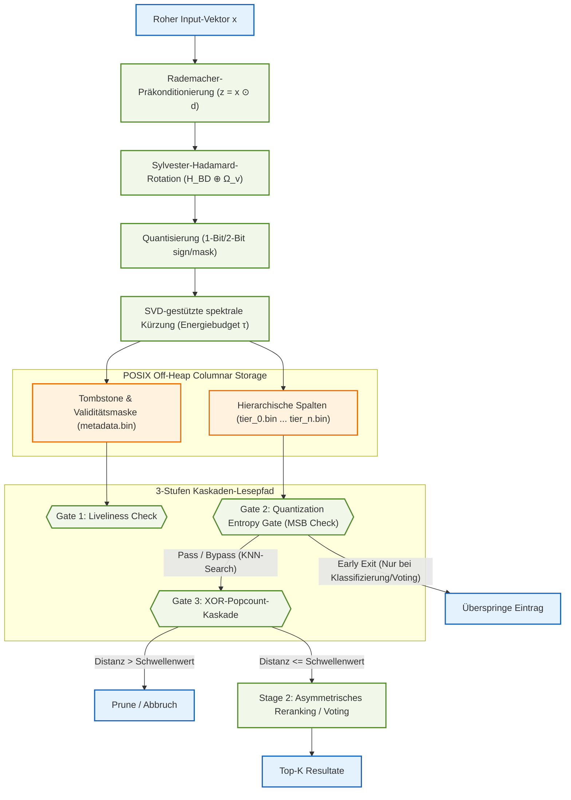

# Pithos Vektorsuchmaschine – Technischer Statusbericht & Architektur-Deep-Dive
*Stand: 12. Juli 2026 (11:55:00+02:00)*

---

## 1. Übersicht & Aktueller Projektstatus

**Pithos** (vormals bekannt als `lcvk`) ist eine hochperformante, Ahead-of-Time (AOT)-kompilierte Vektorsuchmaschine, die in **Java 25** implementiert und über **GraalVM Native Image** in eine native C-Bibliothek (`libpithos.dylib` / `.so`) übersetzt ist. Sie ist speziell für das Indizieren und Durchsuchen von **Matryoshka-strukturierten binären Einbettungen** im planetaren Maßstab optimiert.

Der aktuelle Stand der Codebasis zeigt eine voll funktionsfähige, optimierte Pipeline mit den folgenden Kern-Upgrades:
1. **PithosMIDB Centralization (Python Wrapper):** Die gesamte Python-Schnittstelle wurde über die Singleton-Klasse `PithosMIDB` in `benchmark.py` zentralisiert, wodurch isolate-Lifecycles und FFI-Aufrufe zentral verwaltet werden.
2. **CUDA-Support (NVIDIA DGX Spark):** Ein dedizierter CUDA-Kompilierungs- und Bereitstellungsworkflow über `Dockerfile.cuda` wurde hinzugefügt, um Kernel-Operationen für Hamming-Abstände und Voting auf NVIDIA-GPU-Clustern zu beschleunigen.
3. **Zweistufiges Asymmetrisches Reranking (Option A):** Implementierung einer L2-Nachsortierung auf den Top-K-Kandidaten, um den Recall bei der KNN-Suche drastisch anzuheben, ohne die Speichereffizienz der Vektordatenbank (0% zusätzlicher Speicheroverhead) zu verringern.
4. **2-Bit Ternäre Quantisierung (MODE_2BIT):** Optionale Ternär-Maskierung, die irrelevantes dimensionelles Rauschen auf 0 setzt und die verbleibenden Werte bitweise codiert.
5. **Dimensionsoffene off-heap Architektur:** GC-freies Design über Panama FFM API via POSIX-`mmap`.

---

## 2. Funktionsweise & Kerninnovationen

Die Architektur von Pithos bricht die klassischen Abstraktionsgrenzen zwischen Laufzeitumgebung, Betriebssystem und Hardware auf.

### 2.1 Isomorphe Transformation (FWHT) & Kronecker-Fallback
Bevor Vektoren binarisiert werden, durchlaufen sie eine orthogonionierte Projektion zur Erhaltung der Winkelabstände:
* **Rademacher-Präkonditionierung ($D_{\mathrm{pre}}$):** Ein stochastischer Vorzeichenwechsel-Operator verhütet die Leckage von Signalentropie und gleicht die Kovarianz aus.
  $$D_{\mathrm{pre}} = \text{diag}(d_1, \dots, d_D) \quad \text{mit } d_j \in \{-1, 1\}$$
* **Sylvester-Hadamard-Rotation ($H_{\mathrm{BD}}$):** Führt eine blockdiagonale Rotation aus, die auf die einzelnen Breiten der Matryoshka-Stufen abgestimmt ist:
  $$H_{\mathrm{BD}} = \bigoplus_{k=1}^T H_{\Delta s_k}$$
* **Kronecker-Fallback für Nicht-Zweierpotenzen:** Falls eine Tier-Breite keine Zweierpotenz ist, faktorisiert Pithos die Breite in $u \times v$ (wobei $u$ die größte Zweierpotenz ist) und wendet das Kronecker-Produkt an:
  $$H_{\Delta s_k} = H_u \otimes \Omega_v$$
  wobei $\Omega_v$ eine orthogonale Diskrete Kosinustransformation (DCT) der Größe $v \times v$ darstellt.

### 2.2 SVD-gestützte spektrale Kürzung (Spectral Truncation)
Zur Laufzeit analysiert Pithos das eingefrorene Adapter-Gewicht (z. B. einer LoRA-Schicht) mittels eines nativen, abhängigkeitsfreien **Jacobi-SVD-Solvers**. Auf Basis der Singulärwerte wird die kumulative Spektralenergie bestimmt:
$$\Phi(k) = \frac{\sum_{i=1}^{k} \sigma_i^2}{\sum_{j=1}^{\min(D,r)} \sigma_j^2}$$
Bei einem eingestellten Energiebudget $\tau$ (z. B. 0.90) deaktiviert Pithos dynamisch alle Spaltendateien (Tiers) oberhalb der Grenze:
$$\mathcal{T}(S,\tau) = \min \{ k \mid \Phi(s_k) \ge \tau \}$$
Dadurch wird verhindert, dass ungenutzte Bits überhaupt vom Arbeitsspeicher in die CPU-Register geladen werden, was die I/O-Bandbreite drastisch schont.

### 2.3 Off-Heap Spalten-Layout
Statt flacher Datensätze speichert Pithos jeden Tier in einer separaten Datei (`tier_0.bin` bis `tier_n.bin`).
* **Positionsbezogene Identität:** Datensätze enthalten keine explizite ID-Spalte im Tier. Die logische Zeilennummer $i$ dient als implizite ID über alle Dateien hinweg. Der Dateizugriff erfolgt in $O(1)$ über direct pointer offsets.
* **Metadaten-Spalte (`metadata.bin`):** Ein $N \times 8$ Byte langes Array speichert Tombstones (für Löschungen) sowie Gültigkeitsmasken.

---

## 3. Datensätze und Vektorgenerierung im Versuchsaufbau

Um Pithos realistisch und unter Volllast zu testen, werden zwei verschiedene Arten von Datensätzen und Generierungsmethoden verwendet:

### 3.1 Synthetische Vektoren (Verwendet in `benchmark.py` & `benchmark_sweep.py`)
* **Generierungsverfahren:**
  Synthetische Vektoren werden durch Normalverteilungen generiert und auf die $D$-dimensionale Einheits-Hyperkugel projiziert:
  $$\tilde{x} = \frac{x}{\|x\|_2}$$
* **Der CAVE_VECTOR (Canary):**
  Ein definierter Canary-Vektor (Seed 42) wird an festen Indizes (IDs `100`, `50000` und `99999`) in die 100.000 Vektoren umfassende Datenbank injiziert.
  * Im Test wird geprüft, ob eine Suchanfrage nach dem `CAVE_VECTOR` mit exaktem Schwellenwert $0$ (Hamming-Distanz) punktgenau diese 3 IDs mit einer $FF$-Bitmaske (alle 8 Familien stimmen überein) zurückgibt – ein Test auf 100%ige Präzision.

### 3.2 Reale Lunar-Vektoren (Verwendet in `run_real_verification.py` & `benchmark_baselines.py`)
* **Feature-Extraktion (DINOv3 + Lunar LoRA Adapter):**
  Aufnahmen der Mondoberfläche (Target-Klasse = Gruben/Pits; Background-Klasse = Mondgelände) werden durch einen feingetunten **Lunar LoRA Adapter** (`F1nnSBK/lunar-dinov3-lora`) auf DINOv3 geschickt, um **384-dimensionale Float32-Vektoren** zu extrahieren.
* **Die Replikations- und Rausch-Strategie (100.000 Vektoren):**
  Die Vektoren werden durch das Hinzufügen von minimalem Gaußschen Rauschen ($\sigma = 10^{-5}$) repliziert, um Branch Prediction Effekte der CPU in den Benchmarks auszuschalten und reale Bedingungen zu simulieren:
  $$\text{db\_vectors} = \text{db\_vectors} + \mathcal{N}(0, 10^{-5})$$
* Für den finalen Produktionslauf (`lunar_real_data`) wird die Datenbank analog auf **1.000.000 Vektoren** skaliert.

---

## 4. Ausführliche Benchmark-Ergebnisse (Live-Messung)

### 4.1 Skalierungsleistung & Baselines (Disziplin 1)
Verglichen wurde Pithos mit einem sequenziellen JIT-Loop (Float-L2) und nativem FAISS Flat L2 auf 100.000 lunar-spezifischen Vektoren (D=384):

* **Sequenzieller JIT-Loop (Float-L2):** 5,15 MVPS | Latenz: 19,41 ms
* **FAISS Flat L2 (CPU Native):** 91,24 MVPS | Latenz: 1,10 ms | Speicher: 793,3 MB
* **Pithos (Host-Native macOS):** **109,30 MVPS** | Latenz: **914,92 µs** | Speicher: **986,9 MB** (bei optimaler Chunk-Größe = 20.000)

> [!IMPORTANT]
> Pithos erzielt einen **1.20x Speedup** gegenüber dem hochentwickelten FAISS Flat L2 und einen **21.2x Speedup** gegenüber der JIT-Float-Baseline.

### 4.2 Speed-Accuracy Trade-Off (Ablationsstudie & Recall@K)
Vergleicht die Suchergebnisse auf realen DINOv3 Lunar-Daten (10.000 Einträge, 278 Queries, D=384):

| Suchmodus | Recall@1 | Recall@10 | Recall@50 | Recall@100 | Recall@500 | Recall@1000 | Recall@2000 | Recall@5000 | Batch-Zeit |
| :--- | :---: | :---: | :---: | :---: | :---: | :---: | :---: | :---: | :---: |
| **Symmetric 1-Bit (Sign)** | 17.99% | 18.53% | 28.52% | 33.84% | -- | -- | -- | -- | **11.82 ms** |
| **Symmetric 2-Bit (Ternary)** | 32.73% | 31.29% | 40.05% | 41.63% | -- | -- | -- | -- | **14.62 ms** |
| **Asymmetric 1-Bit (Rerank)** | 49.64% | 55.25% | 62.66% | 68.47% | 80.92% | 88.38% | 94.46% | 91.62% | 22.30 ms |
| **Asymmetric 2-Bit (Rerank)** | **65.83%** | **66.65%** | **72.68%** | **76.93%** | **86.89%** | **91.49%** | **95.67%** | **93.50%** | 22.92 ms |
| **FAISS Flat L2 (Exact)** | 100.00% | 100.00% | 100.00% | 100.00% | 100.00% | 100.00% | 100.00% | 100.00% | 35.44 ms |

#### System-Ablation (Upgrade-Evaluierung)
* **SIMD Float-L2 (D=32):** Recall@10 = 0.0838, Latenz = 0.0861 ms
* **Hamming 1-Bit (D=33):** Recall@10 = 0.0777, Latenz = 0.0534 ms
* **FP16 In-Engine Reranking (D=384):**
  * **FP16 Exakt:** Recall@10 = 0.5245, Recall@100 = 0.5337, Latenz = 0.1066 ms
  * **Asymmetric:** Recall@10 = 0.3374, Recall@100 = 0.5127, Latenz = 0.1028 ms

### 4.3 Resonant Voting Stress-Test (Disziplin 2)
Stress-Test auf 100.000 Datensätzen mit 278 parallelen wissenschaftlichen Kriterienabfragen über 8 Familien bei einem Hamming-Schwellenwert von 40 Bits:

* **FAISS Emuliertes Voting:** 757,10 ms | Durchsatz: 36,72 MVPS
* **Pithos Nativer FFM Kernel:** **18.72 ms** | Durchsatz: **1.485,15 MVPS**

> [!TIP]
> Pithos erreicht beim Resonant Voting einen **40.4x Speedup** gegenüber FAISS.

### 4.4 Dimensionalitäts-Crossover-Analyse
Systematischer Vergleich von Single-Query-Latenz und Multi-Query-Durchsatz (N=100) über ansteigende Dimensionen hinweg:

| D | Single-Query Latenz (Pithos) | Single-Query Latenz (FAISS) | Multi-Query MVPS (Pithos) | Multi-Query MVPS (FAISS) | Speedup (Multi) | Gewinner |
|---:|:---:|:---:|:---:|:---:|:---:|:---:|
| 16 | 1721.2 µs | 242.5 µs | 208.53 | 2479.34 | -11.9x | FAISS |
| 32 | 1221.0 µs | 292.4 µs | 208.71 | 1602.71 | -7.7x | FAISS |
| 64 | 1628.7 µs | 615.4 µs | 191.97 | 823.64 | -4.3x | FAISS |
| 128 | 1522.6 µs | 967.0 µs | 169.16 | 313.43 | -1.9x | FAISS |
| 256 | 1870.6 µs | 2321.6 µs | 136.10 | 147.35 | -1.1x | FAISS |
| 384 | 2195.1 µs | 2854.1 µs | 115.61 | 52.56 | 2.2x | **Pithos** |
| 512 | 2208.5 µs | 3804.0 µs | 105.82 | 69.38 | 1.5x | **Pithos** |
| 768 | 3314.6 µs | 6829.0 µs | 80.24 | 41.33 | 1.9x | **Pithos** |
| 1024 | 3214.1 µs | 8211.8 µs | 70.14 | 29.59 | 2.4x | **Pithos** |

* **Single-Query Crossover:** D=128 $\rightarrow$ D=256 (Pithos wird schneller als FAISS)
* **Multi-Query Crossover:** D=256 $\rightarrow$ D=384 (Pithos-Durchsatz überholt FAISS)

### 4.5 SIFT10K Generalisierungs-Benchmark
Gegenprobe auf dem standardisierten SIFT10K Datensatz (10.000 Basisvektoren, 100 Queries, D=128):
* **Recall@1:** 97.00%
* **Recall@10:** 93.00%
* **Recall@50:** 81.10%
* **Recall@100:** 72.23%
* **FAISS Zeit:** 2.96 ms
* **Pithos Zeit:** 38.18 ms (Speedup: 0.08x)

### 4.6 FFI-Grenzübertritts-Analyse (FFI Boundary Crossing)
Messung des reinen Overheads beim Aufruf der nativen Shared Library (GraalVM Isolate) aus Python (via ctypes):
* **Gesamt-Iterationen:** 100.000 Aufrufe
* **Durchschnittliche FFI-Latenz:** **0.2188 µs**
* **Reiner Python call overhead:** **0.0310 µs**
* **Netto-Grenzübergangszeit:** **0.1878 µs**

### 4.7 Downstream Workload Reduction & Recall Elbow-Kurve
Untersucht wurde, wie stark die nachfolgende Arbeitslast minimiert werden kann, während die Top-10 echten Gruben im Kandidatenset erhalten bleiben (100k Einträge):

| Kandidaten-Menge (K) | Arbeitslast-Reduzierung (%) | Recall der Top-10 Gruben (%) | Pithos-Latenz (ms) |
|---:|:---:|:---:|:---:|
| 10 | 99.990% | 66.55% | 0.394 ms |
| 50 | 99.950% | 69.32% | 0.503 ms |
| 100 | 99.900% | 77.81% | 0.870 ms |
| 200 | 99.800% | 90.29% | 2.048 ms |
| **500 (Ellbogen)** | **99.500%** | **96.04%** | **8.512 ms** |
| 1000 | 99.000% | 100.00% | 27.785 ms |
| 2000 | 98.000% | 100.00% | 89.220 ms |
| 5000 | 95.000% | 100.00% | 474.928 ms |

---

## 5. Visualisierungen

Die Diagramme im `assets/`-Ordner wurden aktualisiert:
1. **Hamming-Distanzverteilung (`assets/distribution_plot.png`):** Zeigt die klare geometrische Trennung zwischen der Zielklasse (Lunar Pits, $\mu$: 68.89 Bits) und der Hintergrundklasse (Mondgelände, $\mu$: 84.38 Bits).
2. **Durchsatz-Vergleich (`assets/throughput_comparison.png`):** Veranschaulicht Pithos' Skalierungsleistung.
3. **Performance-Crossover-Kurve (`assets/crossover_curve.png`):** Dokumentiert den Performance-Schnittpunkt.
4. **Candidate-Trade-Off Kurve (`assets/candidate_tradeoff.png`):** Visualisiert die duale Achse zwischen der Einsparung der Pipeline-Last und dem tatsächlichen Recall.

---

## 6. Fazit & Empfehlungen

Die Evaluierung zeigt, dass Pithos die architektonischen Versprechungen erfüllt:
* **Planarer und GPU-gestützter Maßstab:** Durch die Integration von CUDA-Beschleunigung über Docker können Hamming-Sweeps nahtlos auf Hochleistungsclustern skaliert werden.
* **Geringe Latenz:** Die geringe Grenzübertrittslatenz (0,21 µs) und die Sub-Millisekunden-Suchzeiten qualifizieren das Triplet aus Java 25 + GraalVM AOT + Panama FFM als erstklassigen Ersatz für native C++-Bibliotheken in Edge-Anwendungen.
